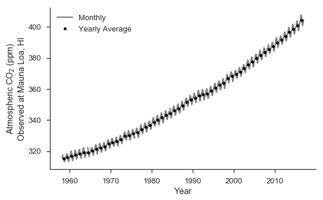
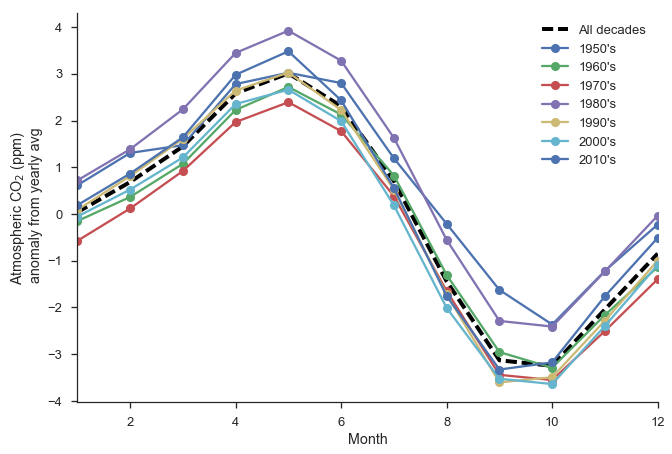
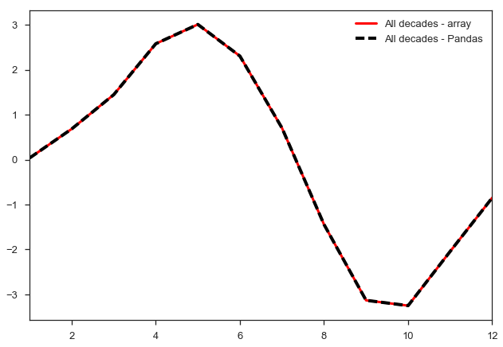
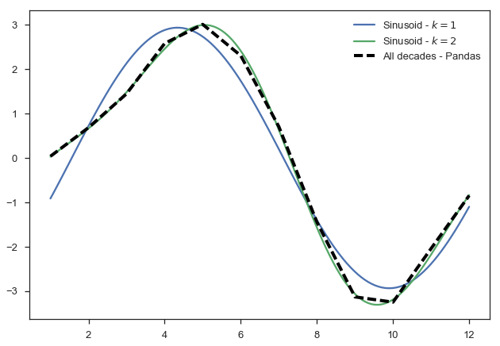
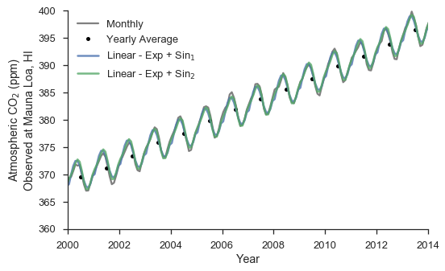

Contemporary Trends in Atmospheric |CO2|
~~~~~~~~~~~~~~~~~~~~~~~~~~~~~~~~~~~~~~~~

We'll start by downloading the monthly mean |CO2| data, using a
shell command in the cell below.

.. code-block:: shell

    wget ftp://aftp.cmdl.noaa.gov/products/trends/co2/co2_mm_mlo.txt .

.. parsed-literal::

    --2017-013-30 14:27:52--  ftp://aftp.cmdl.noaa.gov/products/trends/co2/co2_mm_mlo.txt
               => ‘co2_mm_mlo.txt’
    Resolving aftp.cmdl.noaa.gov... 140.172.200.31
    Connecting to aftp.cmdl.noaa.gov|140.172.200.31|:21... connected.
    Logging in as anonymous ... Logged in!
    ==> SYST ... done.    ==> PWD ... done.
    ==> TYPE I ... done.  ==> CWD (1) /products/trends/co2 ... done.
    ==> SIZE co2_mm_mlo.txt ... 49083
    ==> PASV ... done.    ==> RETR co2_mm_mlo.txt ... done.
    Length: 49083 (48K) (unauthoritative)

    100%[======================================>] 49,083       223KB/s   in 0.2s

    2017-01-30 14:27:54 (223 KB/s) - ‘co2_mm_mlo.txt’ saved [49083]

    --2017-01-30 14:27:54--  http://./
    Resolving .... failed: nodename nor servname provided, or not known.
    wget: unable to resolve host address ‘.’
    FINISHED --2017-01-30 14:27:54--
    Total wall clock time: 2.6s
    Downloaded: 1 files, 48K in 0.2s (223 KB/s)

Read in the table using Pandas' I/O functions. We'll independently
supply column names and have it automatically sniff out the appropriate
whitespace separation between columns. Furthermore, we'll mask missing
values, and construct a pivot-table broken down into a multi-index based
on year and month (which will be useful later on for analysis). Note
that we didn't need to delete the original metadata header to the input
data - using the **comment** argument to ``read_table()``, we can
instruct Pandas to ignore those lines.

.. code-block:: python

    mauna_loa = pd.read_table("co2_mm_mlo.txt", header=None,
                              names=["year", "month", "decimal_date",
                                     "average", "interpolated",
                                     "trend_seas_corr", "missing_days"],
                              delim_whitespace=True, na_values=[-99.99],
                              comment="#")

    mauna_loa_pt = pd.pivot_table(mauna_loa, index=['year', 'month'])
    year_groups = mauna_loa.groupby('year')
    mauna_loa_yearly = year_groups.aggregate(np.mean)

From the data, we'll plot the monthly mean data alongside yearly-mean
data that we've computed by aggregated and averaging the pivot-table
data by year. Note that we shift the index of the yearly data by half of
a year, just for plotting purposes (so it lines up with the middle of
the year).

We'll wrap the plotting mechanics in its own function so that we can use
this as a base for future plots with additional analysis later on.

.. code-block:: python

    fig = plt.figure(figsize=(8, 5))
    ax = fig.add_subplot(111)

    def mauna_loa_plot(ax):
        """ Wrapper for basic Mauna Loa plot, so we can plot additional
        curves later on """

        ax.plot(mauna_loa.decimal_date, mauna_loa.average,
                '-', color='grey', label="Monthly")
        ax.plot(mauna_loa_yearly.index + 0.5, mauna_loa_yearly.average,
                'ok', ms=5, label='Yearly Average')

        ax.legend(loc='upper left')
        ax.set_xlabel("Year")
        ax.set_ylabel("Atmospheric CO$_2$ (ppm)\nObserved at Mauna Loa, HI")
        sns.despine()

        return ax

    ax = mauna_loa_plot(ax)

Now we need to generate polynomial fits to the data. In other terms, we
want to compute the coefficients in equations like

.. math:: P_1(t) = a + bt

and

.. math:: P_2(t) = a + bt + ct^2

such that we minimize the residual between the estimated data and the
observations,

.. math:: \sum\limits_{i=1}^n\big|P_i(t_i) - y(t_i)\big|

For the polynomials, we can use the built-in ``polyfit`` and ``poly1d``
tools from NumPy, which will take care of setting up the polynomials and
evaluating them based on the resulting coefficients we compute. However,
for the exponential fit, we'll use a helper function from SciPy's
``optimize`` package called ``curve_fit``, which allows us to define an
arbitrary functional form. The package will take care of the non-linear
least squares fitting (done via Levenberg-Marquardt in this case). Note
that we could alternatively take the logarithm of the exponential fit,
which produces a linear equation we can fit using traditional
least-squares.

.. code-block:: python

    xi = mauna_loa_yearly.index + 0.5
    yi = mauna_loa_yearly.average

    ## 1st degree
    p_1 = np.poly1d( np.polyfit(xi, yi, 1) )
    print "First order -"
    print p_1

    ## 2nd degree
    p_2 = np.poly1d( np.polyfit(xi, yi, 2) )
    print "Second order -"
    print p_2

    ## Exponential
    from scipy.optimize import curve_fit
    def exp_func(x, a, b, c):
        x_off = x - xi[0] # we re-base x at 0 for numerical
                          # purposes
        return a + b*np.exp(-c*x_off)
    coeff_opt, pcov = curve_fit(exp_func, xi, yi)
    exf = lambda x: exp_func(x, *coeff_opt)
    print "Exponential -"
    print "{0:.2e} + {1:.2e} exp({2:+.2e}*(t - 1850))".format(*coeff_opt)

    fig = plt.figure(figsize=(8,5))
    ax = fig.add_subplot(111)

    mauna_loa_plot(ax)
    ax.plot(xi, p_1(xi), lw=2.5, label="P$_1$($t$)")
    ax.plot(xi, p_2(xi), lw=2.5, label="P$_2$($t$)")
    ax.plot(xi, exf(xi), lw=2,
            label="E($t$)", alpha=.8)
    ax.legend(loc='upper left')

.. parsed-literal::

    First order -

    1.524 x - 2677
    Second order -
            2
    0.0124 x - 47.77 x + 4.63e+04
    Exponential -
    2.56e+02 + 5.76e+01 exp(-1.62e-02*(t - 1850))

.. image:: figs/output_13_3.png

Let's de-trend the data using the 2nd-order polynomial :math:`P_2(t)`,
which produces a rather good fit. Then, we'll average the seasonal cycle
in terms of an anomaly for each decade using a split-apply-combine
operation, and then plot the annual cycle for each decade.

.. code-block:: python

    mauna_loa['average_detrend'] = \
        mauna_loa['average'] - p_2(mauna_loa['decimal_date'])
    mauna_loa['decade'] = \
        np.floor((mauna_loa['year'] - 1900)/10.)

    monthly = mauna_loa.groupby('month')
    ml_mo_cycle = monthly.aggregate(np.mean)
    plt.plot(ml_mo_cycle.index, ml_mo_cycle['average_detrend'],
             '--k', label='All decades', lw=4)

    decade_groups = mauna_loa.groupby(['decade', 'month'])
    ml_dec_cycle = decade_groups.aggregate(np.mean)

    decades = ml_dec_cycle.index.levels[0]
    for decade in decades:
        ml_dec = ml_dec_cycle.loc[decade]
        plt.plot(ml_dec.index, ml_dec['average_detrend'],
                 marker='o', label="%4d's" % (1900+decade*10,))

    plt.legend(loc='upper right')
    plt.xlim(1, 12)
    plt.xlabel('Month')
    plt.ylabel('Atmospheric CO$_2$ (ppm)\n anomaly from yearly avg')

    sns.despine()

The above calculation gives a peak into how powerful Pandas (and similar
libraries) are. The first two lines of the above cell respectively (1)
de-trend the data, and (2) calculate what decade a given value takes
place in. Then, we go on to group all the data with like decades
together, then with like months in each decade, and compute our analysis
that way. If we were more clever, we could've assigned a
``datetime``-like index and automatically inferred these values from
that. It's worthwhile using these sorts of libraries whenever you're
doing timeseries analysis!

Just as a reference, suppose we did not have the nifty timeseries and
analysis capabilities of a package like Pandas. We could still easily
compute the seasonal cycles above, although we'd have to focus our
efforts on keeping track of indices inside a big array. Let's do that,
focusing on computing the average seasonal anomaly cycle over all the
years in the dataset.

Note that we have to do a little bit of index magic to make sure that we
sort the right month into the right place in the array holding the
results. Not unbearable, but the Pandas solution is easier and takes all
of this into account already.

.. code-block:: python

    data = mauna_loa.average_detrend[:]
    year0  = mauna_loa.year.ix[0]
    month0 = mauna_loa.month.ix[0]

    monthly_average = np.zeros(12)
    for month in xrange(12):
        monthly_data = data[month::12] # take every 12th element, starting
                                       # at the month we're on
        # Carefully arrange the averages into the proper
        # index in `monthly_average`, based on what the
        # first month in the dataset is
        idx = (month + month0)
        if idx >= 12:
            idx = idx - 12 # You can also say 'idx -= 12', but that's not very
                           # Pythonic
        monthly_average[idx-1] = np.mean(monthly_data)

    plt.plot(range(1, 13), monthly_average, '-r',
             label="All decades - array", lw=3)
    plt.plot(ml_mo_cycle.index, ml_mo_cycle['average_detrend'],
             '--k', label='All decades - Pandas', lw=4)
    plt.xlim(1, 12)
    plt.legend(loc='upper right')

We can now combine the two procedures. In general, if we were fitting
some sort of functional model to a complex set of data, we might want to
first decompose the model and the data into two separate functions.
Then, we could take the linear combination of the two and call that our
predictor model. We've implicitly done that already, here, by breaking
down the model into a long-term component (the polynomial fits to the
yearly data) and a seasonal anomaly on top of the trend.

We can formalize this approach by fitting a sine curve of the form

.. math:: y(t) \approx \sum\limits_{k=1}^nA_k \sin \frac{2\pi k}{T_k}(t + \phi_k)

where :math:`A`, :math:`T`, and :math:`\phi` are the parameters of
interest. Let's fit the seasonal cycle in this way, and try to model the
long-term |CO2| record using the combination of the long-term
and sesonal components.

*Note* - We've normalized the month in decimal form at the center of the
month (1/12 - 1/24). You don't necessarily have to do this, but it's
something to pay attention for later on.

.. code-block:: python

    ## Drop NaNs from the data since it messes up the
    ## numerical routines
    ml_proc = mauna_loa.dropna()

    xi = ml_proc.month
    xi = (xi/12.) - (1./24.)
    yi = ml_proc.average_detrend

    def sin_func_1(x, A, T, phi):
        return A*np.sin((2.*np.pi/T)*(x + phi))
    sin_comps_1, _ = curve_fit(sin_func_1, xi, yi)
    sin1 = lambda x: sin_func_1(x, *sin_comps_1)

    def sin_func_2(x, A1, A2, T1, T2, phi1, phi2):
        return A1*np.sin((2.*np.pi/T1)*(x + phi1)) \
             + A2*np.sin((2.*np.pi/T2)*(x + phi2))
    sin_comps_2, _ = curve_fit(sin_func_2, xi, yi)
    sin2 = lambda x: sin_func_2(x, *sin_comps_2)

    xs = np.linspace(1., 12., 121)
    xs_norm = xs/12. - 1./24.
    ys1 = sin1(xs_norm)
    ys2 = sin2(xs_norm)
    plt.plot(xs, ys1, label="Sinusoid - $k=1$")
    plt.plot(xs, ys2, label="Sinusoid - $k=2$")
    plt.plot(ml_mo_cycle.index, ml_mo_cycle['average_detrend'],
             '--k', label='All decades - Pandas', lw=4)

    plt.legend()

It's straightforward to now combine the long-term trend and the seasonal
cycle. We can write a wrapper function to automate the combination for
us, and do all the mathemagics that must happen (e.g. month
normalizaton, etc)

.. code-block:: python

    ml_proc = mauna_loa.dropna()
    xi = ml_proc.decimal_date.values[:]
    yi = ml_proc.average[:]

    ## Re-do the exponential fit
    def exp_func(x, a, b, c):
        x_off = x - xi[0] # we re-base x at 0 for numerical
                          # purposes
        return a + b*np.exp(-c*x_off)
    coeff_opt, pcov = curve_fit(exp_func, xi, yi)
    exf = lambda x: exp_func(x, *coeff_opt)

    def combo(x, k=2):
        # Extract the month in decimal form
        month = x - np.floor(x)

        long_term = exf(x)
        if k == 1:
            seasonal = sin1(month)
        elif k == 2:
            seasonal = sin2(month)
        else:
            raise ValueError("k = %d not yet defined" % k)

        return long_term + seasonal

    fig = plt.figure(figsize=(8,5))
    ax = fig.add_subplot(111)

    mauna_loa_plot(ax)
    ys = [combo(xsi, 1) for xsi in xi]
    ax.plot(xi, ys, lw=2.5, label="Linear - Exp + Sin$_1$",
            alpha=0.8)
    ys = [combo(xsi, 2) for xsi in xi]
    ax.plot(xi, ys, lw=2.5, label="Linear - Exp + Sin$_2$",
            alpha=0.8)
    plt.xlim(2000, 2014)
    plt.ylim(360, 400)
    ax.legend(loc='upper left')

We're actually reproducing things incredibly well; we only ever miss out
on some peaks to the seasonal cycle (for example in 2002). Of course,
we'd need to do some rigorous statistical analysis beyond this to
validate that the model isn't just an overfit. But the general steps we
used to break down the various components could certainly be repeated
elsewhere.
