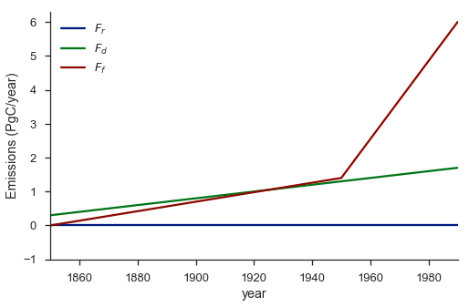
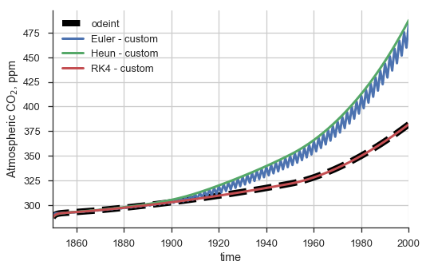
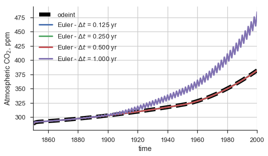
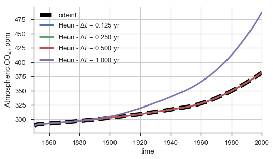
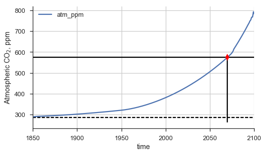
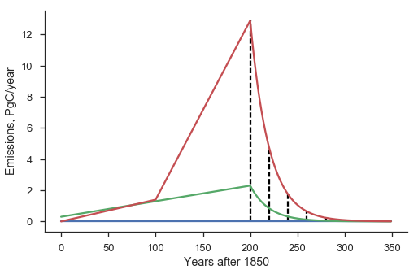
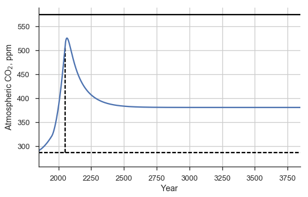

Numerical Methods
~~~~~~~~~~~~~~~~~

I've implemented the model and integrators in Python (see the attached
appendix). Note that I've wrapped the model using objects and classes to
make my code easier to write and use - your mileage may vary on this
front. But at the end of the day, your model should consist of two
components:

1. An implementation of the right-hand side of the governing system of
   ODEs

2. An implementation of the integration/marching algorithm

The latter could be trivially simple. For instance, here is an
implementation of the marching code using Euler's method:

.. code-block:: python

    def integrate(self, func, y0, t):

        out_y = [np.asarray(y0), ]

        for i, ti in enumerate(t[:-1]):
            y = out_y[-1]
            delta_t = t[i+1] - ti
            new_y = y + delta_t*func(y, ti)
            out_y.append(new_y)

        return np.array(out_y)

The code merely evaluates the RHS equation (implemented by ``func``) at
each output instant and uses that to march forward in time.

I've written my code in a simple object-oriented framework, and attached
it as appendices to this solution writeup. In the next cell, we execute
the model code so that we can re-use it. In general, this sort of
framework makes life a lot easier, because we can simply run the model
with two or three lines of code, rather than have a messy for-loop and
intermediate variable re-definition every single time we wish to run it.

First, let's look at the time-dependent emissions input, which we chose
to be

.. raw:: latex

   \begin{align*}
       F_r(t) &= 0 & \\
       F_d(t) &= 0.3+0.01t,\; \text{($t = 0$ for 1850)} \\
       F_f(t) &=
           \begin{cases}
               0.014t & \text{from 1850 to 1950 ($t = 0$ for 1850}) \\
               1.4 + (4.6/40)t & \text{from 1950 to 1990 ($t = 0$ for 1850})
           \end{cases}
   \end{align*}

This produces a time-varying emissions like,

.. code-block:: python

    t0, t_end = 1850, 1990
    t = np.linspace(0, t_end - t0, t_end - t0 + 1)

    ## Vectorize the emissions function so we can quickly compute
    ## emissions for an array of times
    emis_vec = np.vectorize(emissions_22p6)
    Fr, Fd, Ff = emis_vec(t)

    with sns.color_palette("dark"):
        fig = plt.figure(figsize=(8,5))
        ax = fig.add_subplot(111)

        ax.plot(t+t0, Fr, label="$F_r$")
        ax.plot(t+t0, Fd, label="$F_d$")
        ax.plot(t+t0, Ff, label="$F_f$")

    ax.set_ylim(-1)
    ax.set_xlim(t0, t_end)

    sns.despine()
    ax.legend(loc='upper left')
    ax.set_xlabel("year")
    ax.set_ylabel("Emissions (PgC/year)")




So clearly there is a big step up in fossil fuel emissions at 1950. We
should think about this information when we evaluate our model's output
- something should seriously change after 1950.

Reference the appendix for implementations of the solvers/marching
algorithms. We'll go ahead and integrate the model using them all.
Additionally, we'll use SciPy's
```odeint`` <http://docs.scipy.org/doc/scipy/reference/generated/scipy.integrate.odeint.html>`__
wrapper as a reference solution. ``odeint`` wraps the industry standard
LSODA algorithm via a package called `ODEPACK - an old, Fortran-based
library of ODE
solvers <http://people.sc.fsu.edu/~jburkardt/f77_src/odepack/odepack.html>`__.
Specifically, LSODA uses a system's jacobian to more efficiently march
forward in time within specified error and tolerance parameters. In
cases where the user can define the time-dependent jacobian of a system
they wish to solve, the method is particularly efficient - although it
can approximate the jacobian with repeatd calls to the RHS if necessary.
Furthermore, LSODA applies heuristics to the jacobian to analyze a
system's stiffness, and can automatically switch between a stiff and
non-stiff method based on where it can yield the most efficiency.

Below, we evaluate the model run with each of our numerical methods and
the reference one. I'll annotate the code for the reference solution so
it's clear what's happenening.

.. code-block:: python

    from scipy.integrate import odeint

    # Record the initial conditions in an array
    y0 = np.array([612, 730, 140, 37000, 580, 1500, 5300, 1.0])

    # Define a custom emissions function. Here, we use one defined
    # in the appending in carbon_model.py, and we over-ride its
    # arguments such that the "switch" time when emissions turn on
    # occurs 100 years into the simulation. We've assumed that the
    # simulation will start at 1850, as per the documentation for the
    # emissions function.
    emis_func = lambda t: emissions_22p6(t, 100.)

    # Instantiate the model. Note that we 'unpack' the initial condition
    # array, to be consistent with the constructor for the model. We also
    # explicitly pass the emissions function we just created.
    model = CarbonModel(*y0, emis_func=emis_func)

    # Some matplotlib commands to create a canvas for plotting.
    fig = plt.figure(figsize=(8, 5))
    ax = fig.add_subplot(111)

    # Integrate the model using the `odeint` method, for 150. years.
    output = model.integrate(odeint, 150.)

    # Plot the output, setting some styles for its curve.
    output['atm_ppm'].plot(ax=ax, style='--k', label="odeint",
                           lw=8)
    plt.xlim(1850, 1959)

    # We'll now repeat these steps using other numerical method interfaces.
    with sns.color_palette("Paired"):

        print "Euler - custom"
        e = EulerIntegrator()
        o_eu_cust = model.integrate(e, 150., dt=1.)
        o_eu_cust.atm_ppm.plot(ax=ax, lw=3,
                               linestyle='solid', label="Euler - custom")
        print "Heun - custom"
        h = HeunIntegrator()
        o_eu_cust = model.integrate(h, 150., dt=1.)
        o_eu_cust.atm_ppm.plot(ax=ax, lw=3,
                               linestyle='solid', label="Heun - custom")
        print "RK4 - custom"
        r = RK4Integrator()
        o_rk4_cust = model.integrate(r, 150., dt=1.)
        o_rk4_cust.atm_ppm.plot(ax=ax, lw=3,
                                linestyle='solid', label="RK4 - custom")
    ax.set_ylabel("Atmospheric CO$_2$, ppm")
    plt.legend(loc='upper left')
    plt.grid()
    sns.despine()





There are a few things to note on this plot.

First, only the Euler solution has an oscillating component in its
projection of atmospheric |CO2| like we saw in the Mauna Loa
data. However, is that a good thing? In this case, no - our model
*shouldn't have that feature in its output*! If you inspect the model
governing equations, you'll note that there is no component that should
feature a seasonal signal. So this must be a deficiency in the solver.
We might be able to eliminate it with a smaller timestep.

On the other hand, the RK4 solution at the same timestep converges to
the reference solution. This is why it's important to know the
limitations of your numerical methods and to have a good way to dial
into a known solution!

.. code-block:: python

    sns.set_palette("deep")
    fig = plt.figure(figsize=(8, 10))
    ax = fig.add_subplot(211)

    output = model.integrate(odeint, 150.)
    ref = lambda x : np.interp(x, output.index, output.atm_ppm)
    output['atm_ppm'].plot(ax=ax, style='--k', label="odeint",
                           lw=8)
    plt.xlim(1850, 1959)

    e = EulerIntegrator()
    for dt in [1., 0.5, 0.25, 0.125][::-1]:
        label = "Euler - $\Delta t$ = %1.3f yr" % dt
        o = model.integrate(e, 150., dt=dt)
        o.atm_ppm.plot(ax=ax, label=label, lw=3)
    ax.set_ylabel("Atmospheric CO$_2$, ppm")
    ax.legend(loc='upper left')
    ax.grid()
    sns.despine(fig)




That seems to be the case - even halving the timestep is enough to
dramatically improve the solution.

Heun's Rule produces a similar issue, except without the oscillatory
behavior. Reducing the timestep helps in that case, too:

.. code-block:: python

    sns.set_palette("deep")
    fig = plt.figure(figsize=(8, 10))
    ax = fig.add_subplot(211)

    output = model.integrate(odeint, 150.)
    ref = lambda x : np.interp(x, output.index, output.atm_ppm)
    output['atm_ppm'].plot(ax=ax, style='--k', label="odeint",
                           lw=8)
    plt.xlim(1850, 1959)

    h = HeunIntegrator()
    for dt in [1., 0.5, 0.25, 0.125][::-1]:
        label = "Heun - $\Delta t$ = %1.3f yr" % dt
        o = model.integrate(h, 150., dt=dt)
        o.atm_ppm.plot(ax=ax, label=label, lw=3)
    ax.set_ylabel("Atmospheric CO$_2$, ppm")
    ax.legend(loc='upper left')
    ax.grid()
    sns.despine(fig)



Let's use the RK4 implementation to find when CO2 doubles. We can
naively do this by running our model for a longer period of time and
inspecting the solution. Then, to get a numerical estimate, we can
interpolate the model solution so that we have the atmospheric
|CO2| as a smooth function of time. We can use simple
root-finding methods like bisection or Newton-Raphson to then find the
point where it doubles.

.. code-block:: python

    sns.set_palette("deep")
    fig = plt.figure(figsize=(8, 10))
    ax = fig.add_subplot(211)

    plt.xlim(1850)

    r = RK4Integrator()
    o = model.integrate(r, 250., dt=dt)
    o.atm_ppm.plot(ax=ax)

    ax.set_ylabel("Atmospheric CO$_2$, ppm")
    ax.legend(loc='upper left')
    ax.grid()
    sns.despine(fig)

    CO2_0 = o.atm_ppm.iloc[0]
    CO2_double = 2.*CO2_0
    ax.hlines([CO2_0, CO2_double], 1850, 1850+250,
              linestyles=['dashed', 'solid'])

    ## Doubling calculation
    co2_inc = lambda x : np.interp(x, o.index, o.atm_ppm) - CO2_double
    from scipy.optimize import newton
    x_dbl = newton(co2_inc, 2000.)

    ax.plot(x_dbl, CO2_double, "dr", ms=10)
    ax.vlines(x_dbl, ax.get_ylim()[0], CO2_double)

    print "CO2 doubles to {amt:3.0f} ppm in {yr:4.0f}"\
        .format(amt=CO2_double, yr=x_dbl)


.. parsed-literal::

    CO2 doubles to 575 ppm in 2070




The |CO2| level doubles in 2070, so after about 180 years given
the emissions scenario we used.

Alternatively, we could've implemented additional logic in our solver
which would terminate the simulation once a specific ending condition
was met (our doubling of |CO2|. In some cases, this is easy to
do - for instance, some packages straightforwardly implement this into
the integration routine logic they offer. Other times it may not be
possible. Hence, the strategy we use here is probably the best bet - run
the model for a long time, interpolate the output, and then perform your
analysis. This is going to be far more efficient than running the model
many times!

Suppose the world commits to decreasing its emissions in 2050. We'll
model this scenario using an exponentially decaying emissions function
which will kick in after some point. Assume the peak emissions occur in
2050 and save that value as :math:`\mathbf{F}_{2050}` (where all three
components of the emissions are rolled into one vector). Then, we can
write the emissions as

.. math::
    \mathbf{F}(t) = \mathbf{F}_{2050}\exp\left(-\frac{t-2050}{\lambda}\right),\quad t > 2050

where :math:`\lambda` is the e-folding constant, in years.

The easiest way to encode this emissions logic would be to wrap out
original emissions function in a logical block which figures out which
regime we're in. If it's before 2050, then it would spit back the
original emissions values; if not, then it would return the
time-decaying ones. We can write that function and visualize the
emissions trace as a function of time:

.. code-block:: python

    def cust_emis(t, t_off=2050, t0=1850, lam=20.):
        """ t=0 corresponds to t0 """
        emis_ref = emissions_22p6(t)
        if t <= t_off - t0:
            return emis_ref
        else:
            E_2050 = np.array(emissions_22p6((t_off - t0)))
            # Swap the following lines to force the
            # de-forestation emissions to decay as well
            #E_2050[2] = E_2050[2]*np.exp(-(t-(t_off - t0))/lam)
            E_2050 = E_2050*np.exp(-(t-(t_off - t0))/lam)
            return E_2050

    lam = 20.
    ts = np.arange(0., 2200-1850., 1.)
    ee = np.array([cust_emis(ti, lam=lam) for ti in ts])
    fig = plt.figure(figsize=(8,5))
    ax = fig.add_subplot(111)
    ax.plot(ts, ee)
    ax.set_xlabel("Years after 1850")
    ax.set_ylabel("Emissions, PgC/year")

    for i in xrange(0, 6):
        x = (2050-1850) + i*lam
        ax.vlines(x, 0, cust_emis(x, lam=lam)[-1],
                  linestyles='dashed')

    sns.despine(fig)




In this scenario, the emissions become negligible with 3 or 4 e-foldings
(dashed lines in the reference plot). That's fine - does that mean that
|CO2| will reduce on the same timescale of about 100 years?

.. code-block:: python

    model = CarbonModel(*y0, emis_func=cust_emis)
    r = RK4Integrator()
    o = model.integrate(odeint, 2000., dt=0.25)

.. code-block:: python

    fig = plt.figure(figsize=(8,5))
    ax = fig.add_subplot(111)

    o.atm_ppm.plot(ax=ax)
    ax.set_xlabel("Year")
    ax.set_ylabel("Atmospheric CO$_2$, ppm")

    CO2_0 = o.atm_ppm.iloc[0]
    CO2_double = 2.*CO2_0
    ax.hlines([CO2_0, CO2_double], 1850, 1850+2000,
              linestyles=['dashed', 'solid'])

    ## Doubling calculation
    co2_inc = lambda x : np.interp(x, o.index, o.atm_ppm) - CO2_double
    from scipy.optimize import newton
    x_dbl2 = newton(co2_inc, 2100.)
    ax.plot(x_dbl2, CO2_double, "dr", ms=10)
    ax.vlines(x_dbl2, ax.get_ylim()[0], CO2_double)

    ax.vlines(2050, CO2_0, np.interp(2050, o.index, o.atm_ppm),
              linestyles='dashed')

    ax.grid()
    sns.despine()

    print
    print "Doubling (initial) - ", x_dbl
    print " Doubling (return) - ", x_dbl2
    print "               Max - ", np.max(o.atm_ppm)
    print "          Year Max - ", np.argmax(o.atm_ppm)

.. parsed-literal::

    Doubling (initial) -  2069.64325981
     Doubling (return) -  3214346871.43
                   Max -  525.899214083
              Year Max -  2065.5




A few things are noteable about this graph.

1. Although the emissions begin to rapidly decay in 2050, the maximum
   atmospheric |CO2| (about 842 ppm) occurs two decades later
   in 2065).

2. To return to a state of doubled |CO2|, it takes until 2229 -
   or 162 years after the maximum |CO2| is observed, and just
   shy of 180 years after emissions begin to reduce!

3. We ran the simulation for 2000 years, and it did not return to
   pre-industrial levels. In fact, it plateaued at about 500 ppm, but
   not until after 2500 - **700** years after the emissions began to
   ramp up.

4. Try running your simulation for 5000, 10000, or 50000 years
   (preferably with the reference numerical solver). In this model, the
   carbon sink from the atmosphere into all the other reservoirs is
   never enough to decrease the atmospheric |CO2| back to
   pre-industrial levels, regardless of how long you let the model run.
