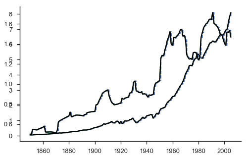
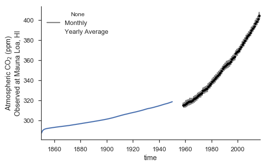
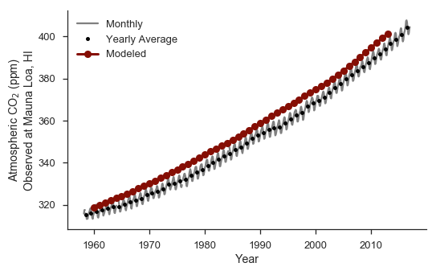
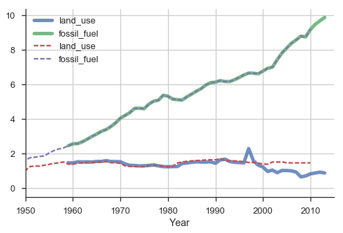
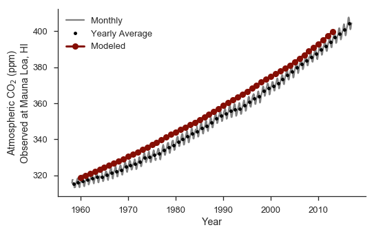
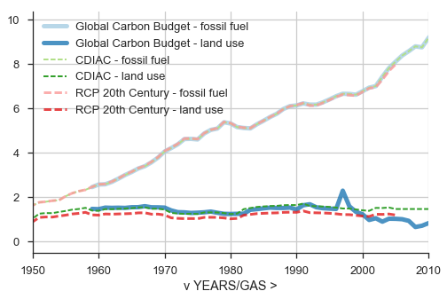
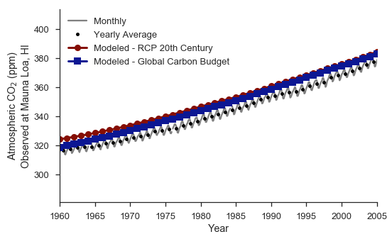
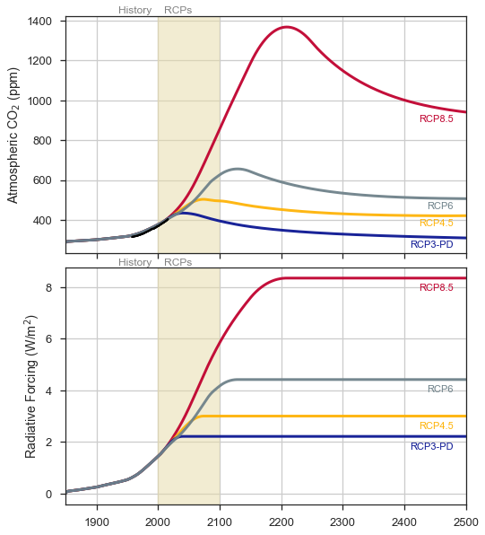

Model Application to Observed Atmospheric |CO2| Concentrations
~~~~~~~~~~~~~~~~~~~~~~~~~~~~~~~~~~~~~~~~~~~~~~~~~~~~~~~~~~~~~~

Finally, we'll apply our model to try to understand the 20th century
atmospheric |CO2| record.

20th Century Emissions
^^^^^^^^^^^^^^^^^^^^^^

.. code-block:: shell

    ## Download the data, process separately
    # 1) Land-use data
    wget http://cdiac.ornl.gov/trends/landuse/houghton/Global_land-use_flux-1850_2005.xls

    # 2) Fossil-fuel data
    wget http://cdiac.ornl.gov/ftp/ndp030/CSV-FILES/global.1751_2010.csv

.. parsed-literal::

    --2017-01-30 14:39:55--  http://cdiac.ornl.gov/trends/landuse/houghton/Global_land-use_flux-1850_2005.xls
    Resolving cdiac.ornl.gov... 160.91.16.103
    Connecting to cdiac.ornl.gov|160.91.16.103|:80... connected.
    HTTP request sent, awaiting response... 200 OK
    Length: 193024 (188K) [application/vnd.ms-excel]
    Saving to: ‘Global_land-use_flux-1850_2005.xls.1’

    100%[======================================>] 193,024     1.01MB/s   in 0.2s

    2017-01-30 14:39:55 (1.01 MB/s) - ‘Global_land-use_flux-1850_2005.xls.1’ saved [193024/193024]

    --2017-01-30 14:39:55--  http://cdiac.ornl.gov/ftp/ndp030/CSV-FILES/global.1751_2010.csv
    Resolving cdiac.ornl.gov... 160.91.16.103
    Connecting to cdiac.ornl.gov|160.91.16.103|:80... connected.
    HTTP request sent, awaiting response... 200 OK
    Length: 6729 (6.6K) [text/csv]
    Saving to: ‘global.1751_2010.csv.1’

    100%[======================================>] 6,729       --.-K/s   in 0s

    2017-01-30 14:39:55 (126 MB/s) - ‘global.1751_2010.csv.1’ saved [6729/6729]

.. code-block:: python

    ## Read in the data
    # 1) Land-use data (TgC / year)
    #    in Excel spreadsheet form, should be fine w/ pandas
    lu_data = pd.read_excel("Global_land-use_flux-1850_2005.xls",
                            sheetname="net fluxes", index_col=0)
    # convert from TgC to PgC
    lu_data = lu_data*1e-3

    #print lu_data.head()

    # 2) Fossil-fuel data (million metric tons, which is one million
    #    megagrams or one teragram)
    ff_data = pd.read_csv("global.1751_2010.csv", skiprows=[1,],
                          index_col=0)
    # convert to PgC
    ff_data = ff_data*1e-3
    #print ff_data.tail()

    ## 3) Collect into single dataframe
    ff_col = 'Total carbon emissions from ' + \
             'fossil fuel consumption and ' + \
             'cement production (million '  + \
             'metric tons of C)'
    ff_data.rename(columns={ff_col: 'fossil_fuel'}, inplace=True)
    ff_series = ff_data['fossil_fuel']

    lu_data.rename(columns={'Global': 'land_use'}, inplace=True)
    lu_series = lu_data['land_use']

    cdiac_data = pd.concat([lu_series, ff_series], axis=1)

    ## Some post-processing on the merged data
    # a) interpolate linearly for any missing data
    cdiac_data.interpolate(inplace=True)
    # b) mask NaNs to 0
    cdiac_data[np.isnan(cdiac_data)] = 0.

Interpolate the data using the various recommendations. We'll use PCHIP
for the higher-order, piecewise-polynomial interpolation.

.. code-block:: python

    ts = np.linspace(1850, 2005, 12.*155 + 1.)

    cx  = cdiac_data.index.values
    lu = cdiac_data['land_use'].values
    ff = cdiac_data['fossil_fuel'].values

    fig = plt.figure(figsize=(8, 5))
    plt.clf()
    ax_ff = fig.add_subplot(111)
    ax_lu = plt.twinx(ax=ax_ff)

    ## Base data
    #cdiac_data['land_use'].plot(ax=ax_lu, linewidth=5)
    #cdiac_data['fossil_fuel'].plot(ax=ax_ff, linewidth=5)
    #ax.set_xlim(1850, 2005)

    ## 1) Constant for each year
    def emis_cdiac_floor(t):
        t_base = int(np.floor(t))
        idx = t_base - cx[0]
        return 0., lu[idx], ff[idx]
    yi = np.array([emis_cdiac_floor(t) for t in ts])
    ax_lu.plot(ts, yi[:, 1], '--', label='LU - const')
    ax_ff.plot(ts, yi[:, 2], '--', label='FF - const')

    ## 2) Linear interpolation
    def emis_cdiac_linear(t):
        lu_int = np.interp(t, cx, lu)
        ff_int = np.interp(t, cx, ff)
        return 0., lu_int, ff_int
    yi = np.array([emis_cdiac_linear(t) for t in ts])
    ax_lu.plot(ts, yi[:, 1], '-.', label='LU - lin')
    ax_ff.plot(ts, yi[:, 2], '-.', label='FF - lin')

    ## 3) PCHIP
    from scipy.interpolate import PchipInterpolator
    pchip_lu = PchipInterpolator(cx, lu)
    pchip_ff = PchipInterpolator(cx, ff)
    def emis_cdiac_pchip(t):
        return 0., pchip_lu(t), pchip_ff(t)
    yi = np.array([emis_cdiac_pchip(t) for t in ts])
    ax_lu.plot(ts, yi[:, 1], '-k', label='LU - pchip')
    ax_ff.plot(ts, yi[:, 2], '-k', label='FF - pchip')

    for i, x in enumerate([ax_lu, ax_ff]):
        ax.set_xlim(1980, 2000)
        ax.grid(False)
        if i == 1: ax.legend(loc='upper left')
    sns.despine(fig)

**Note** - There's a caveat worth considering here with serious impacts
when applying these techniques to true research. There are two ways to
interpret the emissions data. On the one hand, we can simply view them
as *intensities* or *instantaneous rates*. Under this interpretation,
the interpolation techniques are valid in that we have a series of
datapoints where an emissions intensity :math:`E` was observed at some
point in time :math:`t`, and we wish to re-construct the time-depended
function :math:`\hat{E}(t)` based on the dataset :math:`\{(t_i, E_i)\}`.

But there's a different way to look at the data which might be more
relevant. In that case, the emissions data is **not** instaneous.
Rather, its an aggregate of how much was emitted over a given time
period (in this case, a one year interval). Under this schema, we can't
merely interpolate the emissions intensities as before. Instead, we need
to interpolate with the condition that the integral of the emissions
curve over the periods of time between observations is conserved. That
is, our curve connecting January 1, 2014 to January 1, 2015 needs to
conform to the fact that, say, 10 PgC was emitted in that same interval
of time. Now we have an additional problem of *non-uniqueness*; you
could possibly imagine that there are infinite families of interpolating
factions that could satisfy these constraints.

With our linearly-interpolated emissions data, let's try to simulate the
observed |CO2| record.

.. code-block:: python

    t_start = 1850
    t_end = 1950
    emis_wrap = lambda x: emis_cdiac_linear(t_start + x)

    model = CarbonModel(*y0, emis_func=emis_wrap)
    r = RK4Integrator()

    o_spinup = model.integrate(r, t_end - t_start, dt=1.)

    fig = plt.figure(figsize=(8, 5))
    ax = fig.add_subplot(111)
    mauna_loa_plot(ax)
    o_spinup.atm_ppm.plot(ax=ax)

    y_1950 = o_spinup.iloc[-1].values[:-4]

Feed in the results from the simulation to 1950 as the initial
conditions for a simulation running from 1960 to 2013.

.. code-block:: python

    model = CarbonModel(*y_1950, emis_func=emis_wrap)
    r = RK4Integrator()
    t_start = 1960
    t_end = 2013
    o = model.integrate(r, t_end - t_start, dt=1.,
                        t_offset=t_start)

    fig = plt.figure(figsize=(8, 5))
    ax = fig.add_subplot(111)
    mauna_loa_plot(ax)
    ax.plot(o.index, o.atm_ppm,
            label='Modeled', marker='o',
            color=sns.xkcd_rgb['indian red'],
            lw=3)

    o_cdiac = o.copy()

    ax.legend(loc='upper left')

That's not a bad fit at all! Accounting for our slight difference in
initial conditions, we capture a reasonable rate of increase for
atmospheric |CO2|, very much in line with the observational
record. This is good evidence that our model does a reasonable job of
reconciling the dynamics of the global carbon cycle - certainly well
enough to dive deeper!

Repeat the previous exercise with the Global Carbon Budget dataset.

.. code-block:: shell

    ## Download the data
    wget ftp://cdiac.ornl.gov/pub/Global_Carbon_Project/Global_Carbon_Budget_2014_v1.0.xlsx

.. parsed-literal::

    --2017-01-30 14:42:14--  ftp://cdiac.ornl.gov/pub/Global_Carbon_Project/Global_Carbon_Budget_2014_v1.0.xlsx
               => ‘Global_Carbon_Budget_2014_v1.0.xlsx.1’
    Resolving cdiac.ornl.gov... 160.91.16.103
    Connecting to cdiac.ornl.gov|160.91.16.103|:21... connected.
    Logging in as anonymous ... Logged in!
    ==> SYST ... done.    ==> PWD ... done.
    ==> TYPE I ... done.  ==> CWD (1) /pub/Global_Carbon_Project ... done.
    ==> SIZE Global_Carbon_Budget_2014_v1.0.xlsx ... 512344
    ==> PASV ... done.    ==> RETR Global_Carbon_Budget_2014_v1.0.xlsx ... done.
    Length: 512344 (500K) (unauthoritative)

    100%[======================================>] 512,344     1.48MB/s   in 0.3s

    2017-01-30 14:42:15 (1.48 MB/s) - ‘Global_Carbon_Budget_2014_v1.0.xlsx.1’ saved [512344]

.. code-block:: python

    gcb = pd.read_excel("Global_Carbon_Budget_2014_v1.0.xlsx",
                        sheetname="Global Carbon Budget",
                        skiprows=19, index_col=0)
    col_map = {
        'fossil fuel and cement emissions': 'fossil_fuel',
        'land-use change emissions': 'land_use',
    }
    gcb.rename(columns=col_map, inplace=True)

    cx  = gcb.index.values
    lu = gcb['land_use'].values
    ff = gcb['fossil_fuel'].values

    # Use a simple linear interpolation over the emissions data
    def emis_gcb_linear(t):
        lu_int = np.interp(t, cx, lu)
        ff_int = np.interp(t, cx, ff)
        return 0., lu_int, ff_int

For quick reference, let's plot the GCB emissions data against the CDIAC
emissions data:

.. code-block:: python

    fig = plt.figure(figsize=(8, 5))
    ax = fig.add_subplot(111)
    gcb[['land_use', 'fossil_fuel']]\
        .plot(ax=ax,
              linewidth=5, alpha=0.8)
    cdiac_data.plot(ax=ax, linestyle='dashed')

    ax.set_xlim(1950, 2015)
    ax.grid()
    sns.despine()

There's not much of a difference, except the GCB data (in the solid
colors) seems to capture a bit more nuance in the land-use budget after
1995.

Using the Global Carbon Budget as our emissions, let's re-run the
compartmental model from the branch-off point we previously used with
CDIAC:

.. code-block:: python

    emis_gcb = lambda x: emis_gcb_linear(t_start + x)

    ## Run the model from the saved solution
    #model = CarbonModel(*y_1950*0.995, emis_func=emis_gcb)
    model = CarbonModel(*y_1950, emis_func=emis_gcb)
    r = RK4Integrator()
    t_start = 1960
    t_end = 2013
    o = model.integrate(r, t_end - t_start, dt=1.,
                        t_offset=t_start)
    o_gcb = o.copy()

    fig = plt.figure(figsize=(8, 5))
    ax = fig.add_subplot(111)
    mauna_loa_plot(ax)
    ax.plot(o.index, o.atm_ppm,
            label='Modeled', marker='o',
            color=sns.xkcd_rgb['indian red'],
            lw=3)

    ax.legend(loc='upper left')

Once again, we very closely reproduce the observed record from Mauna
Loa. In fact, we tend to improve the simulation post 1995 - we capture
the rate of increase a bit more exactly, although in actuality we made
only a modest tweak to the total emissions.

Looking Towards the Future
^^^^^^^^^^^^^^^^^^^^^^^^^^

Now that we have some confidence in our model's ability to capture
reality, let's apply it to understand something about future climate
change. To do this, we'll use the "Representative Concentration
Pathways" (RCP) which were previously used in the CMIP5 global climate
model intercomparison. These RCPs are hypothetical scenarios describing
how future greenhouse gas emissions might change. In a climate model,
we'd use them as input to determine the atmospheric concentration in
each year for use with the model's radiation module (with a caveat -
some models have a global interactive carbon cycle, so in that case
you'd use a slightly different formulation, but with the advantage of
detecting feedbacks from that system).

For our purposes, let's just simulate how the emissions scenarios would
matriculate into future |CO2| concentrations. We'll start by
reading in the emissions scenarios and plotting them as before.

.. code-block:: shell

    ## Download the CMIP5 data
    wget http://www.pik-potsdam.de/~mmalte/rcps/data/20THCENTURY_EMISSIONS.xls
    wget http://www.pik-potsdam.de/~mmalte/rcps/data/RCP3PD_EMISSIONS.xls
    wget http://www.pik-potsdam.de/~mmalte/rcps/data/RCP45_EMISSIONS.xls
    wget http://www.pik-potsdam.de/~mmalte/rcps/data/RCP6_EMISSIONS.xls
    wget http://www.pik-potsdam.de/~mmalte/rcps/data/RCP85_EMISSIONS.xls

.. code-block:: python

    ## Read in the 20th century emissions database, construct
    ## time-varying emissions function, and produce a simulation of
    ## the 20th century
    rcp_20th = pd.read_excel("20THCENTURY_EMISSIONS.xls",
                             sheetname="20THCENTURY_EMISSIONS",
                             skiprows=36, index_col=0)
    index_map = {"v YEARS/GAS >": "years", }
    col_map = {"FossilCO2": "fossil_fuel", "OtherCO2": "land_use"}
    rcp_20th.rename(index_map, col_map, inplace=True)

    cx  = rcp_20th.index.values
    lu = rcp_20th['land_use'].values
    ff = rcp_20th['fossil_fuel'].values

    def emis_rcp_20th_linear(t):
        lu_int = np.interp(t, cx, lu)
        ff_int = np.interp(t, cx, ff)
        return 0., lu_int, ff_int

    split_str = lambda s : s.replace("_", " ")

    with sns.color_palette('Paired'):
        fig = plt.figure(figsize=(8, 5))
        ax = fig.add_subplot(111)

        for name, df, ls, lw, alpha in \
            [('Global Carbon Budget', gcb, 'solid', 5., 0.8),
             ('CDIAC', cdiac_data, '--', 2., 1.0),
             ('RCP 20th Century', rcp_20th, '--', 3., 0.8)]:

            for key in ["fossil_fuel", "land_use"]:
                df[key].plot(ax=ax, lw=lw, ls=ls, alpha=alpha,
                             label="%s - %s" % (name, split_str(key)))
        ax.legend(loc='upper left')
        ax.grid()
        ax.set_xlim(1950, 2010)
        sns.despine()

We notice that 20th Century RCP analysis slightly disagrees with both
the CDIAC and GCB ones. However, the difference is enough that we might
be interested in how this affects our simulation of 20th century
atmospheric carbon dioxide, so we should plot up a quick comparison.

.. code-block:: python

    t_start = 1850
    t_end = 2005

    emis_rcp_20th = lambda x: emis_rcp_20th_linear(t_start + x)

    ## Run the model from the initial conditions
    model = CarbonModel(*y0, emis_func=emis_rcp_20th)
    r = RK4Integrator()

    o = model.integrate(r, t_end - t_start, dt=1.,
                        t_offset=t_start)
    o_rcp_20th = o.copy()

    fig = plt.figure(figsize=(8, 5))
    ax = fig.add_subplot(111)
    mauna_loa_plot(ax)
    ax.plot(o_rcp_20th.index, o_rcp_20th.atm_ppm,
            label='Modeled - RCP 20th Century', marker='o',
            color=sns.xkcd_rgb['indian red'],
            lw=3)
    ax.plot(o_gcb.index, o_gcb.atm_ppm,
            label='Modeled - Global Carbon Budget', marker='s',
            color=sns.xkcd_rgb['royal'],
            lw=3)

    ax.set_xlim(1960, 2005)

    ax.legend(loc='upper left')

    y_rcp_2005 = o_rcp_20th.iloc[-1].values[:-4]

Actually, not much of a difference.

Projection of future climate change using RCP scenarios
^^^^^^^^^^^^^^^^^^^^^^^^^^^^^^^^^^^^^^^^^^^^^^^^^^^^^^^

Now, let's simulate the future climate change scenarios defined by each
RCP. This cell will combine everything we've done so far: loading in an
emisisons dataset, converting it to a function, instantiating a model
run, and running the model.

.. code-block:: python

    scenarios = {
        "RCP3-PD": {
            'short': "RCP3PD",
            "description": "Low RCP with pick and decline",
            "color": sns.xkcd_rgb['royal'],
        },
        "RCP4.5": {
            'short': "RCP45",
            "description": "Medium-low RCP with stabilisation from 2150 onwards",
            "color": sns.xkcd_rgb['amber'],
        },
        "RCP6": {
            'short': "RCP6",
            "description": "Medium-high RCP with stabilisation from 2150 onwards",
            "color": sns.xkcd_rgb['steel grey'],
        },
        "RCP8.5": {
            'short': "RCP85",
            "description": "High RCP, stabilising emissions post-2100, concentrations post-2200",
            "color": sns.xkcd_rgb['lipstick red'],
        },
    }

    for rcp in scenarios.keys():
        print rcp, scenarios[rcp]['description']

        ## Read emissions
        short = scenarios[rcp]['short']
        rcp_emis = pd.read_excel("%s_EMISSIONS.xls" % short,
                                 sheetname="%s_EMISSIONS" % short,
                                 skiprows=37, index_col=0)
        index_map = {"v YEARS/GAS >": "years", }
        col_map = {"FossilCO2": "fossil_fuel", "OtherCO2": "land_use"}
        rcp_emis.rename(index_map, col_map, inplace=True)
        scenarios[rcp]['emissions'] = rcp_emis

        ## Linearly interpolate emissions
        cx  = rcp_emis.index.values
        lu = rcp_emis['land_use'].values
        ff = rcp_emis['fossil_fuel'].values

        def emis_rcp_linear(t):
            lu_int = np.interp(t, cx, lu)
            ff_int = np.interp(t, cx, ff)
            return 0., lu_int, ff_int

        scenarios[rcp]['emissions_interp'] = emis_rcp_linear

        ## Run and save model outpu
        t_start, t_end = 1850, 2500

        emis_rcp_wrap = lambda x: emis_rcp_linear(t_start + x)

        ## Run the model from the initial conditions
        model = CarbonModel(*y0, emis_func=emis_rcp_wrap)
        r = RK4Integrator()
        o = model.integrate(r, t_end - t_start, dt=0.25,
                            t_offset=t_start)
        scenarios[rcp]['output'] = o.copy()

.. parsed-literal::

    RCP8.5 High RCP, stabilising emissions post-2100, concentrations post-2200
    RCP4.5 Medium-low RCP with stabilisation from 2150 onwards
    RCP3-PD Low RCP with pick and decline
    RCP6 Medium-high RCP with stabilisation from 2150 onwards

Plot the results, adding some useful details to the figure.

.. code-block:: python

    fig, [ax_CO2, ax_RF] = plt.subplots(2, 1, figsize=(8, 10),
                                        sharex=True)
    plt.subplots_adjust(hspace=0.06)

    for rcp in scenarios.keys():
        output = scenarios[rcp]['output']
        color = scenarios[rcp]['color']

        output.atm_ppm.plot(ax=ax_CO2, color=color,
                            lw=3, alpha=0.95, label=rcp)
        ax_CO2.text(2480, output.atm_ppm.ix[2500]-50., rcp,
                color=color, ha='right', size=11)
        mauna_loa_yearly.average.plot(ax=ax_CO2, color='k')

        delta_F = 5.35*np.log(output.atm_ppm/output.atm_ppm.ix[1850])
        idx_max = np.argmax(delta_F)
        delta_F.ix[idx_max:] = delta_F.ix[idx_max]
        delta_F.plot(ax=ax_RF, color=color, lw=3, alpha=0.95,
                     label=rcp)
        ax_RF.text(2480, delta_F.ix[2500]-0.5, rcp,
                   color=color, ha='right', size=11)

    ax_CO2.set_ylabel("Atmospheric CO$_2$ (ppm)")
    ax_RF.set_ylabel("Radiative Forcing (W/m$^2$)")

    for ax in [ax_CO2, ax_RF]:
        ax.grid()
        ax.set_xlabel("")

        # RCP vs observations annotation
        ax.axvspan(2000, 2100, color=sns.xkcd_rgb['beige'],
                   alpha=0.5)
        ax.text(1990, ax.get_ylim()[1]*1.01, "History", color='grey',
                ha='right')
        ax.text(2010, ax.get_ylim()[1]*1.01, "RCPs", color='grey',
                ha='left')

This plot is similar to what's on the RCP website. For simplicity, I
froze the radiative forcing plots at their maximum values.

There are many clear implications of these simulations. For starters,
the high-emissions scenario produce a significant amount of radiative
forcing up to and beyond the year 2100. This would have substantial
impacts on our global climate - including significant warming in the
global average. The radiative equivalent of doubling |CO2| is
about 4 degrees per watt per meter-squared. For a rough and dirty
calculation, in the RCP8.5 case, this would yield a little more than 6
degrees of warming in equilibrium. That's *a lot*!

Of course, this neglects many things. For instance, what might happen to
the carbon cycle in a warming climate? Consider the land-use budget we
use in our emissions. Although de-forestation is a major component of
it, shifts in precipitation and temperature could also affect the type
and presence of vegetation in many places around the world. If
precipitation were to drastically decrease in a region that otherwise
would experience a large amount on average, significant loss of
vegetation could occur and affect the magnitude of the global carbon
sink. In that sense, there would be a *positive feedback* on climate
change - the shrinking of the carbon sink as the world warms would, on
average, tend to increase the rate of increase of carbon in the
atmosphere, producing even more warming. Constraining the magnitude of
global carbon cycle feedbacks is a major contemporary research issue,
and some modern global models even include detailed carbon cycle models
(much more so than what we've done here - real models coupled to the
chemistry and biology of the oceans and land surface) to reconcile these
effects.
